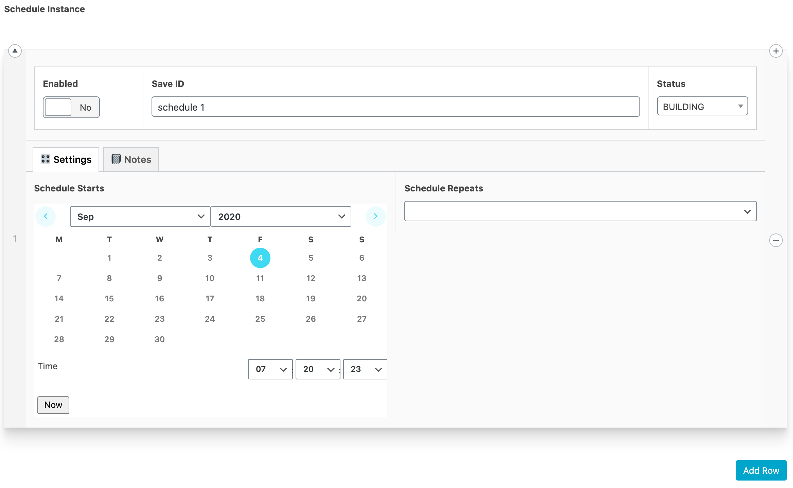

# ACF inline DateTime Picker Field

Welcome to the Advanced Custom Fields Inline DateTime Picker repository on Github.

This is a duplication of the existing datetime field code, but renders inline rather than in a popup.

My extended explanation of the changes are on the ACF forum here: [Inline datetime pickers?](https://support.advancedcustomfields.com/forums/topic/inline-datetime-pickers/)

Or below:

## Changes

OK, I’m going to answer my own question. It took a little time, but you can do it. For now, I’ve edited the core files, but will make my own ACF field to not interfere with the base datetimepicker.

Two things to know:
1. The datetimepicker is an extension of the jQuery UI date picker. It has a known bug that will NOT allow the time to be set in inline mode. However, I have a fix for that.
2. To activate inline mode, you need to target a `<div>` or `<span>` as the target for the datetimepicker instead of the `<input>` tag.

So, step one is to update the `render_field` method in the `acf_field_date_and_time_picker.php` file and class.

Just to keep to the style of the existing code, I inserted a new DIV using the acf methods here:
```
$text_input = array(
			'class' 				=> 'input',
			'value'					=> $display_value,
		);

		$inline_calendar = array(
			'class'					=> 'calendar-inline input'
		);
		
		
		// html
		?>
		<div <?php acf_esc_attr_e( $div ); ?>>
			<?php acf_hidden_input( $hidden_input ); ?>
			<?php // acf_text_input( $text_input ); ?>
			<div <?php acf_esc_attr_e( $inline_calendar ); ?>></div>
		</div>
		<?php
		
	}
```
This will insert the div below the text input, and comment out the text input.

Next, update the `acf-input.js` file to edit the javascript of the picker.

Note that the datetimepicker is an extension of the date picker. So, around line 5811 there will be a definition for the date_picker and it will declare the `$inputText`.

```
$inputText: function(){
			return this.$('.calendar-inline');
			// return this.$('input[type="text"]');
		},
```
This should now return your .calendar-inline class instead of the `<input>` tag.

Lastly, a bit further down, in the date_time_picker section (not date_picker section) there is a declaration to `add.newDateTimePicker` on line 6031. We need to update that to update the calendar with the current time.

```
// add

	acf.newDateTimePicker = function( $input, args ){
		
		// bail ealry if no datepicker library
		if( typeof $.timepicker === 'undefined' ) {
			return false;
		}
		
		// defaults
		args = args || {};
		
		// NEW - Remember date/time
		$date = args.altField[0].value;

		// initialize (This wipes the datetime in inline mode)
		$picker = $input.datetimepicker( args );

		// update to current datetime with the value 2 lines above.
		$picker.datetimepicker('setDate', (new Date($date)) );
		
		// wrap the datepicker (only if it hasn't already been wrapped)
		if( $('body > #ui-datepicker-div').exists() ) {
			$('body > #ui-datepicker-div').wrap('<div class="acf-ui-datepicker" />');
		}
	};
```
We effectively store the datetime before we initialise the datetimepicker and then update it once it’s created.

Now you should have an embedded calendar.

Couple of gotchas:
1. Remember to hard-reload and clear cache to reload the new JS.
2. The acf-input.min.js gets loaded by default, you can test the `acf-input.js` by updating the `/includes/assets.php` file and the `enqueue_script` location OR just define the constant `SCRIPT_DEBUG` to use the non-minified version.